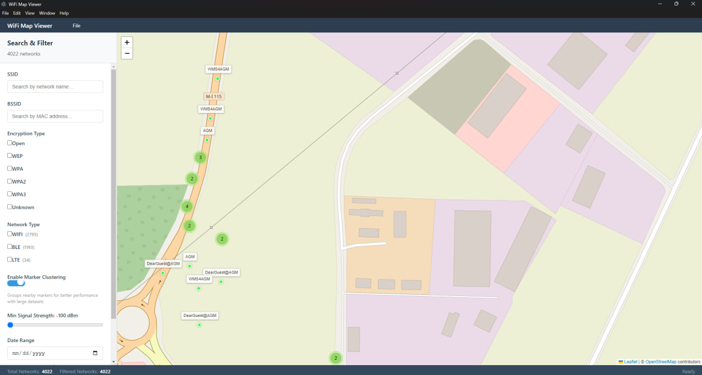
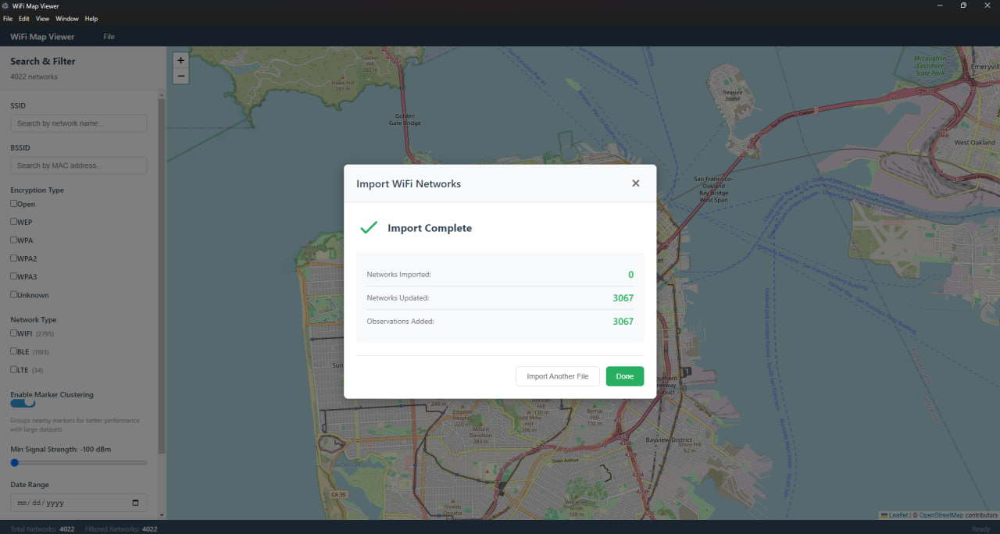

# WiFi Map Viewer

> This app is just something I wanted since I had lot of performance issues with WiGLE. At this stage it's all offline cos I feel more comfortable that way (I am not dev). I got access to test version of Kiro, new vibe coding IDE from Amazon and decided to try it out. There are issues, and there can always be improvements but for someone who's dumb as they get I'm happy.

An offline desktop WiFi mapping application - like WiGLE but completely local and private. Visualize WiFi networks on an interactive map using data from wardriving apps. Fully compatible with WiGLE WiFi Wardriving app exports and other popular formats.

**100% Offline** - All data stays on your machine. No accounts, no cloud, no tracking.

## Screenshots

### Interactive Map View

*Visualize WiFi networks on an interactive map with clustering and filtering options*

### Import Dialog

*Import data from WiGLE, Kismet, KML, and SQLite formats with progress tracking*

## Features

- 📍 Interactive map visualization with OpenStreetMap
- 📊 Support for multiple file formats (WiGLE CSV, Kismet CSV, KML, SQLite)
- 🔍 Advanced search and filtering (SSID, BSSID, encryption, signal strength, date range)
- 🗄️ Local SQLite database for offline operation
- 🏢 Automatic manufacturer lookup via OUI database
- 🎯 Trilateration for accurate network positioning
- 🚀 Optimized for large datasets (1M+ networks)
- 🔒 Completely offline - no data leaves your machine

## Installation

### Building from Source

Pre-built binaries coming soon. For now, build from source:

#### Prerequisites

**Windows**
- Node.js 18+ 
- Visual Studio Build Tools with "Desktop development with C++" workload
  - Download from: https://visualstudio.microsoft.com/downloads/
  - Or install via: `npm install --global windows-build-tools` (requires admin)

**macOS**
- Node.js 18+
- Xcode Command Line Tools: `xcode-select --install`

**Linux**
- Node.js 18+
- Build essentials: `sudo apt-get install build-essential python3`
- For AppImage: `sudo apt-get install fuse libfuse2`

#### Install Dependencies

```bash
npm install
```

Note: `better-sqlite3` requires native compilation. If installation fails, ensure you have the build tools installed for your platform.

## Development

Start the development server with hot reload:

```bash
npm run electron:dev
```

## Building

### Build for Current Platform

```bash
npm run build
```

### Build for Specific Platform

```bash
# Windows
npm run build:win

# macOS
npm run build:mac

# Linux
npm run build:linux
```

### Quick Test Build (No Installer)

```bash
npm run package
```

This creates an unpacked directory in `release/` for quick testing without creating installers.

## Build Output

All build artifacts are created in the `release/` directory:

- **Windows**: `WiFi-Map-Viewer-{version}-x64.exe` (NSIS installer)
- **macOS**: `WiFi-Map-Viewer-{version}-x64.dmg` and `WiFi-Map-Viewer-{version}-arm64.dmg`
- **Linux**: `WiFi-Map-Viewer-{version}-x64.AppImage` and `WiFi-Map-Viewer-{version}-x64.deb`

## Usage

1. **Launch the application**
2. **Import data**: File → Import, then select your WiFi data file
3. **Explore**: Pan and zoom the map to view networks
4. **Search**: Use the search panel to filter networks by SSID, BSSID, encryption, etc.
5. **Details**: Click on network markers to view detailed information

### Supported File Formats

- **WiGLE CSV**: Direct export from WiGLE WiFi Wardriving Android app (fully compatible)
- **WiGLE SQLite**: WiGLE database files from the Android app
- **Kismet CSV**: Export from Kismet wireless detector
- **KML**: Google Earth format with network data

**Note**: This app is designed to work seamlessly with data collected by the [WiGLE WiFi Wardriving](https://play.google.com/store/apps/details?id=net.wigle.wigleandroid) Android app, but runs entirely offline on your desktop.

## Project Structure

```
├── electron/          # Electron main and preload processes
│   ├── main.ts       # Main process entry point
│   ├── preload.ts    # Preload script for IPC
│   ├── database.ts   # Database initialization
│   └── ConfigRepository.ts
├── src/              # React application source
│   ├── components/   # React components
│   ├── services/     # Business logic services
│   ├── parsers/      # File format parsers
│   ├── database/     # Database repositories
│   ├── utils/        # Utility functions
│   └── types/        # TypeScript type definitions
├── build/            # Build resources (icons)
├── docs/             # Documentation
├── dist/             # Vite build output
├── dist-electron/    # Electron build output
└── release/          # Packaged application output
```

## Documentation

- [Build and Packaging Guide](docs/BUILD_PACKAGING.md) - Detailed build instructions
- [Testing Packaged Application](docs/TESTING_PACKAGED_APP.md) - Testing checklist
- [Configuration Usage](docs/CONFIG_USAGE.md) - Configuration options
- [Import Dialog Implementation](docs/IMPORT_DIALOG_IMPLEMENTATION.md) - Import feature details
- [IPC Implementation](docs/IPC_IMPLEMENTATION.md) - Electron IPC architecture
- [Error Handling](docs/ERROR_HANDLING_IMPLEMENTATION.md) - Error handling strategy
- [Performance Optimizations](docs/PERFORMANCE_OPTIMIZATIONS.md) - Performance tuning

## Configuration

The application uses minimal configuration stored in:
- **Windows**: `%APPDATA%/wifi-map-viewer/config.json`
- **macOS**: `~/Library/Application Support/wifi-map-viewer/config.json`
- **Linux**: `~/.config/wifi-map-viewer/config.json`

Default settings are applied on first launch. See [CONFIG_USAGE.md](docs/CONFIG_USAGE.md) for details.

## Database Location

The SQLite database is stored in:
- **Windows**: `%APPDATA%/wifi-map-viewer/networks.db`
- **macOS**: `~/Library/Application Support/wifi-map-viewer/networks.db`
- **Linux**: `~/.config/wifi-map-viewer/networks.db`

## Performance

The application is optimized for large datasets:
- Handles 1M+ networks efficiently
- Map rendering with viewport culling
- Batch imports with progress tracking
- Database indexing for fast queries
- Memory-efficient streaming parsers

## Privacy & Security

- **100% Offline**: No data is transmitted to external servers
- **Local Storage**: All data stored in local SQLite database
- **No Telemetry**: No analytics or tracking
- **Secure**: Input validation and SQL injection prevention

## Troubleshooting

### Build Issues

**Native module compilation fails**
```bash
# Rebuild native modules
npm rebuild better-sqlite3
```

**Missing build tools**
- Windows: Install Visual Studio Build Tools
- macOS: Install Xcode Command Line Tools
- Linux: Install build-essential package

### Runtime Issues

**Application won't launch**
- Check that you have the required runtime dependencies
- Try running from command line to see error messages

**Database errors**
- Delete the database file and restart the application
- Check file permissions on the app data directory

**Import fails**
- Verify file format is supported
- Check file is not corrupted
- Ensure sufficient disk space

## Contributing

Contributions are welcome! Please:
1. Fork the repository
2. Create a feature branch
3. Make your changes
4. Add tests if applicable
5. Submit a pull request

## License

MIT License - see LICENSE file for details

## Acknowledgments

- Built with [Electron](https://www.electronjs.org/)
- Map visualization by [Leaflet](https://leafletjs.com/)
- Database by [better-sqlite3](https://github.com/WiseLibs/better-sqlite3)
- OUI data from [IEEE](https://standards.ieee.org/)
